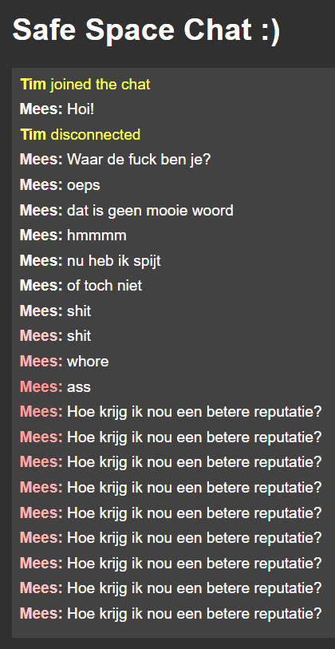
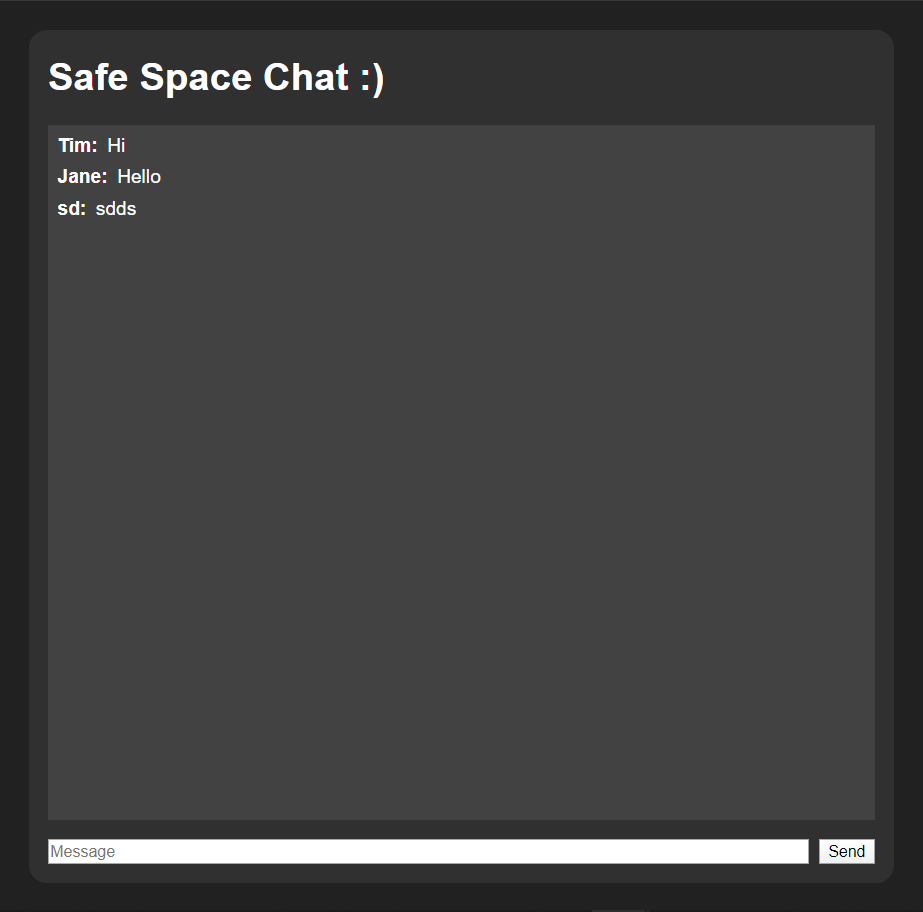
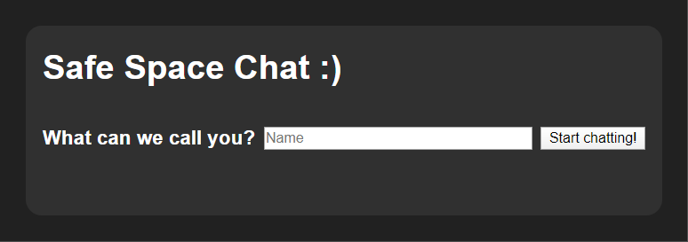
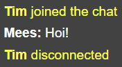
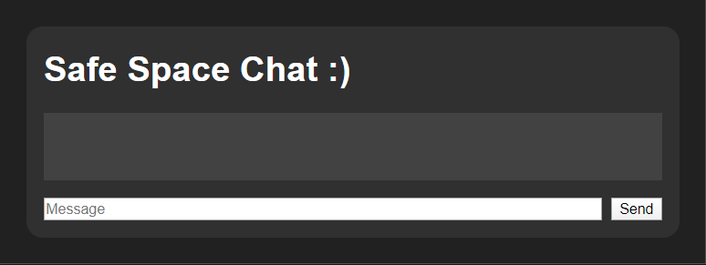
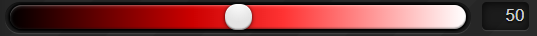

# Safe Space Chat
Let me introduce you to Safe Space Chat! This is a single-room chat app, but with a catch. This chat app has a reputation system based on the amount of bad words a user uses. The reputation of a user is indicated by the intensity of the color red in their username.

<details>
<summary>Click here to see an example</summary>



</details>


## Demo's

[Live Demo](https://safe-space-chat.herokuapp.com/)



## But why?

The world has to much hatred and we need more love and peace, or something like that. Let the **haters** stand out and defer them from the good folk.

## How does it work

When the user navigates to the website, he or she is asked to enter a (user)name



Once the user has entered a username, it is saved on the user's socket on the server:
```javascript
socket.on('set username', function (name) {
    if (!socket.userName && name) {
        console.log(`user with id ${socket.userName} connected`);

        socket.userName = name;
        socket.broadcast.emit('server message', `<b>${socket.userName}</b> joined the chat`);
    }
});
```
It will also broadcast a message to everyone in the chat using:
```javascript
socket.broadcast.emit('server message', `<b>${socket.userName}</b> joined the chat`)
```
Here is what it looks like:



Here is how to client checks whether a username is valid:

```javascript
$("#set_username").click(() => {
    const usernameInput = $("#username").val().trim();
    if (usernameInput) {
        setUserName(usernameInput);
    }
});
```

Subsequently the username is emitted to the server's socket with the namespace  `set username`. The username-input container is also "replaced" by the chat-room:

```javascript
function setUserName(userName) {
    socket.emit('set username', userName);

    $(".username-input-container").css("display", "none");
    $(".chat-main-wrapper").css("visibility", "visible");
}
```

<details>
<summary>username-input container</summary>


</details>

<details>
<summary>chat-room</summary>



</details>

## Bad word filter

when the user tries to send a message using `socket.on('user message')` it checks for bad words. In the server, when a bad word is present in the message it worsens the user's reputation by 5. When the user sends a message without a bad word it improves the user's reputation by 1. This means messages with bad words have 5 times more effect on your reputation than if they don't. The reputation is a number between 50 and 100:

```javascript
if (containsBadWord(message)) {
    console.log("Bad word found");

    newReputation = (oldReputation - 5);
    if (newReputation < 50) {
        newReputation = 50
    }
} else {
    console.log("No bad word found");

    newReputation = (oldReputation + 1);
    if (newReputation > 100) {
        newReputation = 100
    }
}
```

The number representing the reputation is equal to the lightness of the color red of the username. The color is pure white when this value is 100. The color red is the most bright when the value is 50. At value 0 the color is black:



The color is set using the HSL color value. The Hue (h) value is set to either 0 or 360, this represents the color red on the color spectrum. The Saturation (s) is set to 100% to get the most intense color possible. 

The color value is somewhere between: `hsl(0, 100%, 50%)` and `hsl(0, 100%, 100%)`. 

The user's name is wrapped in a bold tag and contains a color style:

```javascript
<b style="color: hsl(0, 100%, ${socket.reputation}%);">
    ${socket.userName}:
</b>
```

Here is the function that checks for bad words:

```javascript
function containsBadWord(message) {
    // Source: https://www.freewebheaders.com/full-list-of-bad-words-banned-by-google/
    const badWords = ['anal', 'anus', 'arse', 'ass', 'ass fuck', 'ass hole', 'assfucker', 'asshole', 'assshole', 'bastard', 'bitch', 'black cock', 'bloody hell', 'boong', 'cock', 'cockfucker', 'cocksuck', 'cocksucker', 'coon', 'coonnass', 'crap', 'cunt', 'cyberfuck', 'damn', 'darn', 'dick', 'dirty', 'douche', 'dummy', 'erect', 'erection', 'erotic', 'escort', 'fag', 'faggot', 'fuck', 'Fuck off', 'fuck you', 'fuckass', 'fuckhole', 'god damn', 'gook', 'hard core', 'hardcore', 'homoerotic', 'hore', 'lesbian', 'lesbians', 'mother fucker', 'motherfuck', 'motherfucker', 'negro', 'nigger', 'orgasim', 'orgasm', 'penis', 'penisfucker', 'piss', 'piss off', 'porn', 'porno', 'pornography', 'pussy', 'retard', 'sadist', 'sex', 'sexy', 'shit', 'slut', 'son of a bitch', 'suck', 'tits', 'viagra', 'whore', 'xxx'];

    // Source: https://stackoverflow.com/a/46337280/11119707
    return badWords.some(badWord => message.includes(badWord));
}
```

There is a long array with all the bad words and a check if the message contains any of the bad words.